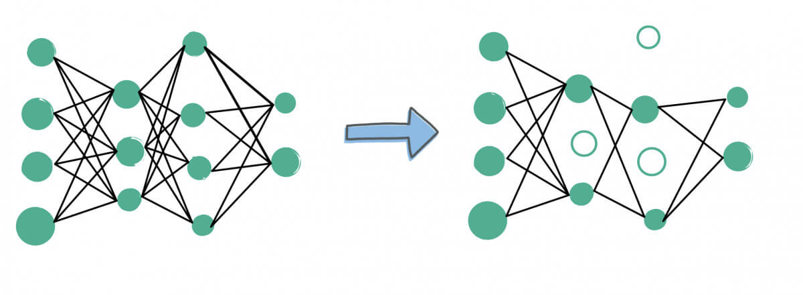

# ⚡ Pruning Of Neural Netork

  

&nbsp;

Neural network pruning using the Lottery Ticket approach requires tuning three hyper-parameters: the number of rounds, the number of epochs per round, and the sparsity level. Finding the best combination of these parameters can be computationally expensive.
